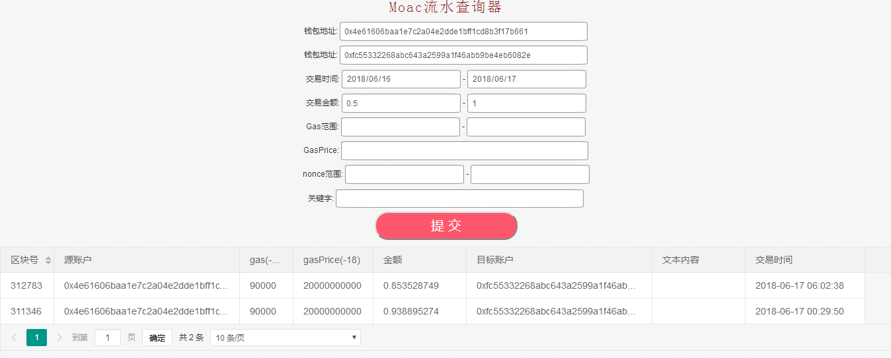

# Moac-Record-Scan
[](http://standardjs.com/)
[](https://coveralls.io/github/samstefan/consul-service-wrapper?branch=master)
[](https://badge.fury.io/js/consul-service-wrapper)
[](https://circleci.com/gh/samstefan/consul-service-wrapper)

Moac已经有自己的<a href="http://explore.moac.io">浏览器</a>用来查看其公链的区块数据和交易流水，对于普通用户，其简单的交易查询基本上能满足需求，但是对于接入其公链的开发者或调试者，其功能很难满足需求。
 - 目前还没有找到测试网的浏览器，MY GOD，大部分的开发都是在测试网，你要让所有上链开发者都能通过接口来查询吗？
 - 根据钱包地址进行筛选查询，主要包括交易时间段的查询，交易金额端的查询，Gas费使用情况查询.
 - Nonce的查询和相关处理，开发过程中发生问题有很大一部分是在nonce上，特别是微服务分布式版的应用
 - 文本的查询，即Input中的内容进行筛选，上链的业务通常很简单，大部分都是文本直接上传到Input中，怎么查询呢？难道还需要用户自己去建立一个数据库进行本地缓存，成本过大？
 - 钱包中的统计问题，分不同时间进行交易金额、GAS费的统计，现在还需要用户自己建立数据库进行本地缓存
 - 更高级的需求：钱包中文本中的某些内容统计，etc

## 主要功能
-提供流水Hash、转账钱包、接收钱包流水查询的API接口。
-提供带时间段、交易金额段、GAS费段、Nonce段，文本内容模糊查询的API接口
-提供复杂条件的可视化查询页面
-实现了数据的读写分离的功能，提供高性能的读写操作
-实现了Consul的微服务注册的功能，为大型接入提供可能
-实现了Docker镜像，直接使用Docker即可部署在本地
-灵活的配置，可以实现Moac测试网和主网的配置，可以实现读、写及微服务版的配置

## 将来的功能
这些功能目前不实现，有机会形成商业版可以考虑
-写数据的检查，保证所有区块数据都写入到数据库
-建立用户体系，为高频接入用户提供更友好的服务和功能
-实现MOAC、ETH、Jingtum的流水统一查询
-提供高可用的微服务版搭建方案
-统计功能的实现，特别是文本中内容统计功能的实现

## 前提条件
```
开发环境：Node ^6.9.0 
运行环境：Docker 1.12以上即可
```

## Getting started
运行Docker
```
docker run -d --name moac_record_scan_test -p  8200:8200  -p 8545:8545  -p 30333:30333  --restart=always  --net=host \
 --restart=always  --env TESTNET="--testnet"  -v /data/moac_test/:/root/   mgichain/moac_record_scan:0.9.0

```
访问页面：
```
http://localhost:8200/
```
[]


## License
License (MIT)

Copyright (c) 2017 Sam Stefan, http://samstefan.co.uk

Permission is hereby granted, free of charge, to any person obtaining a copy of this software and associated documentation files (the "Software"), to deal in the Software without restriction, including without limitation the rights to use, copy, modify, merge, publish, distribute, sublicense, and/or sell copies of the Software, and to permit persons to whom the Software is furnished to do so, subject to the following conditions:

The above copyright notice and this permission notice shall be included in all copies or substantial portions of the Software.

THE SOFTWARE IS PROVIDED "AS IS", WITHOUT WARRANTY OF ANY KIND, EXPRESS OR IMPLIED, INCLUDING BUT NOT LIMITED TO THE WARRANTIES OF MERCHANTABILITY, FITNESS FOR A PARTICULAR PURPOSE AND NONINFRINGEMENT. IN NO EVENT SHALL THE AUTHORS OR COPYRIGHT HOLDERS BE LIABLE FOR ANY CLAIM, DAMAGES OR OTHER LIABILITY, WHETHER IN AN ACTION OF CONTRACT, TORT OR OTHERWISE, ARISING FROM, OUT OF OR IN CONNECTION WITH THE SOFTWARE OR THE USE OR OTHER DEALINGS IN THE SOFTWARE.


0x4e61606baa1e7c2a04e2dde1bff1cd8b3f17b661


https://github.com/samstefan/consul-service-wrapper/blob/master/README.md